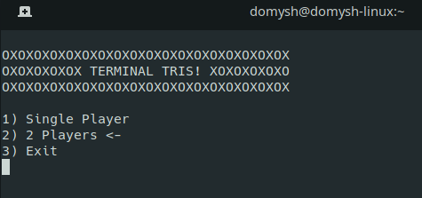

<h1> TerminalMenu </h1>

## Multiplatform Library for Terminal Menu (Windows, OSX, GNU/Linux) 
<center></center>
A c++ and python Library that can create a Selection menu in termial
In this header file there are function (Compatible with Mac OSX, Windows and Linux ) for create the Menu:

- MenuCreate(std::string arr[],int length,const char* intestation="",int n=0,const char* arrsym="<-")

For example: MenuCreate(v,"SELECT THE ANSWERE","<<:-|",1);
The is the principal function that create the menu and return the number of the position of the voice in the vector
This function is thinked to use with a switch case:

### General use of the function
```
switch(MenuCreate(...)){
  case 0:
    break;
  case 1 [...]
}
```
### Example
```
#include <iostream>
#include "TerminalMenu.h"

int main(){
  char *selection[]={"Print Hello","exit"}; //array of string is also accepted
  while(true){
    switch(MenuCreate( selection,2 )){
      case 0:
        std::cout << "Hello World!"<< std::endl;
        SysPause(); //Read under this example for discover this function
        break;
      case 1:
        return 0;
    }
  }
}

```

- SysPause() 
Function that simulate -> system("pause") (In windows this command corrispond to that)


- getch() 
Getch function in MacOs(normaly present for windows in <conio.h>)

- inBufferClear()
Function that clear the input Buffer (Used for delete bugs using input in MenuCreate and SysPause)

## Other Function

- detectKey()
- PrintLineMenu(const std::vector<std::string> &lines,int pos,int arrow,const char *SymArrow="<-")
- PrintMenu(const std::vector<std::string> &lines,int arrow,const char* intestation="",const char* arrsym="<-")

Not the same function are writed in python
In python you need to install also pynput
```pip install pynput```
